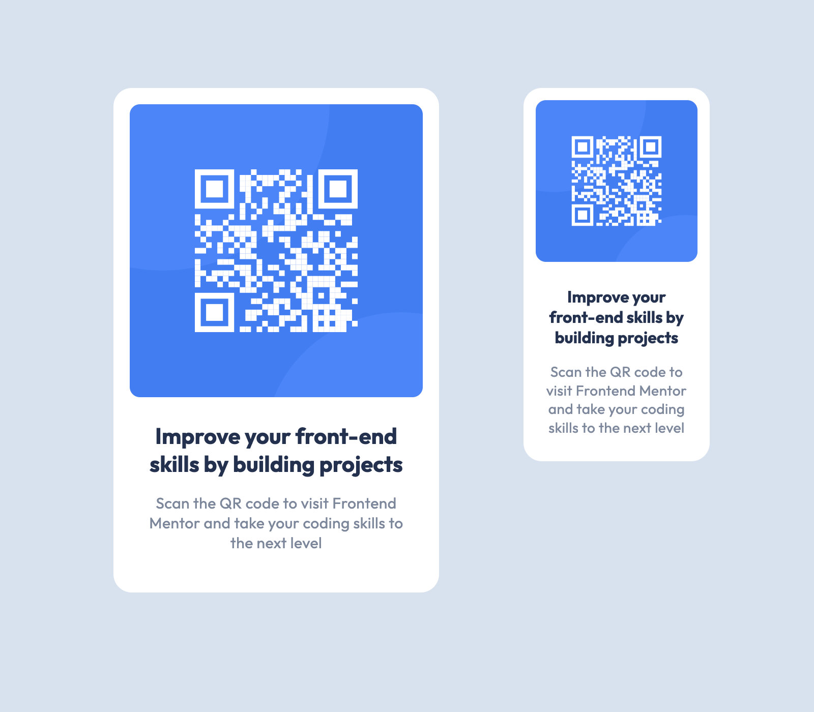

# Frontend Mentor - QR Code Component solution

This is a solution to the [QR code component challenge on Frontend Mentor](https://www.frontendmentor.io/challenges/qr-code-component-iux_sIO_H). Frontend Mentor challenges help you improve your coding skills by building realistic projects. 

## Table of contents

- [Frontend Mentor - QR Code Component solution](#frontend-mentor---qr-code-component-solution)
  - [Table of contents](#table-of-contents)
  - [Overview](#overview)
    - [Screenshots](#screenshots)
    - [Links](#links)
  - [My process](#my-process)
    - [Built with](#built-with)
    - [What I learned](#what-i-learned)
    - [Continued development](#continued-development)
  - [Author](#author)

## Overview

### Screenshots

Desktop & Small Mobile

### Links

- [Solution code on Github](https://github.com/mindful108/frontendmentor-qr-code-component.git)
- [Live solution](https://frontendmentor-qr-code-component-sigma.vercel.app)

## My process

### Built with

- Semantic HTML5 markup
- CSS with custom properties (variables)
- Flexbox
- Mobile-first workflow

### What I learned

I almost skipped this project because it's so simple, but it was still great practice to develop my workflows and see how quickly I can complete projects.

I also added an additional breakpoint for smaller screen sizes.

### Continued development

I plan to do more Frontend Mentor projects to continue developing my speed and workflow using my own custom snippets and starter templates. I will also start to use Tailwind CSS and looking forward to incorporating React for more interactive challenges.

 
## Author

- Website - [Judah Lynn](https://judahlynn.com)
- Frontend Mentor - [@mindful108](https://www.frontendmentor.io/profile/mindful108)